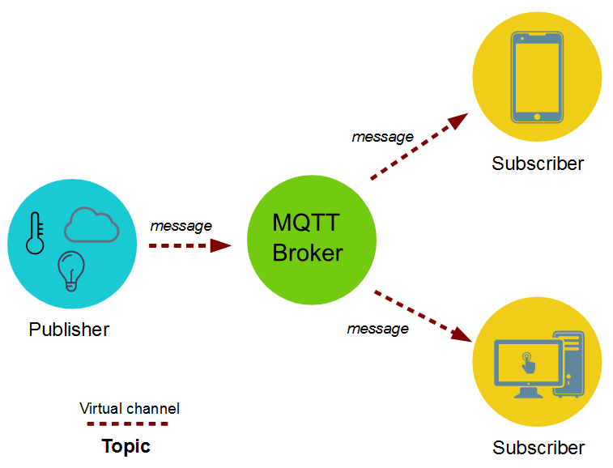

# Welcome

Welcome to HTA 2018.

## Who am I

* Software engineer since 2005
* Active member of the Apache Software Foundation
* Working in the industry, providing customers with automation and control systems

## Motivation

* Automation in the industry is currently a big topic
* IoT
* Industry 4.0
* Good slogans, communication and collaboration is key

## Request - Response

* Application provides endpoints as a service
* The classic approach
* A well known pattern with good toolings

## Request - Response: Disadvantages

* Tight coupling between client and service
* Extending existing endpoints with more functionality is hard
* Distributing data to several hundred endpoints is challenging
* Scalability is challenging

## Publish-Subscribe

## Publish-Subscribe: Features

* Decouples publisher and subscriber spatially
* Decouples publisher and subscriber by time

## Publish-Subscribe: Advantages

* Scalability
* Extensibility
* Naturally fits async and event driven programming
* Request-Response is a special case

## Publish-Subscribe: Considerations

* Designing topics can be challenging
* Designing payloads can be challenging
* A publisher may assume that a subscriber is listening, when in fact it is not
* Assuring delivery of messages involves additional topics and overheads
* Hiding information from subscribers (can be solved with encryption)
* Rogue publishes by malicious or faulty nodes (can be solved with signatures)

## What is MQTT

MQTT is a light weight protocol that:

* provides publish-subscribe pattern
* is designed to consume only very little power
* requires only a very small memory footprint
* requires very low bandwith

## First hands on

* Clients that publish temperature information

## Implementing Request-Response

* Request topic:  `{endpoint}/request/{requestId}`
* Response topic: `{endpoint}/response/{requestId}`

## Implementing Request-Response: Echo

* Service subscribes to `echo/request/+`
* Client subscribes to `echo/response/1`
* Client publishes to `echo/request/1`
* Service publishes to `echo/response/1`

## Request-Response Alternative

In case changes require a response both on success and failure:

* Publish values: `{applicationId}/property/{name}`
* Topic for changes: `{applicationId}/property/{name}/request`
* Topic for change responses: `{applicationId}/property/{name}/response`

## Request-Response Alternative

In case changes require a response both on success and failure where change
requests can be identified uniquely:

* Publish values: `{applicationId}/property/{name}`
* Topic for changes: `{applicationId}/property/{name}/request/{id}`
* Topic for change responses: `{applicationId}/property/{name}/response/{id}`

## Request-Response Alternative

In case changes require a response only on success:

* Publish topic: `{applicationId}/property/{name}`
* Topic for changes: `{applicationId}/property/{name}/set`

## Second hands on

* Temperature alarm service

## Related work

* Sparkplug
* DDS (Data Distribution Service)

## Questions?

## Thanks

* dpsenner@gmail.com
* dpsenner@apache.org

